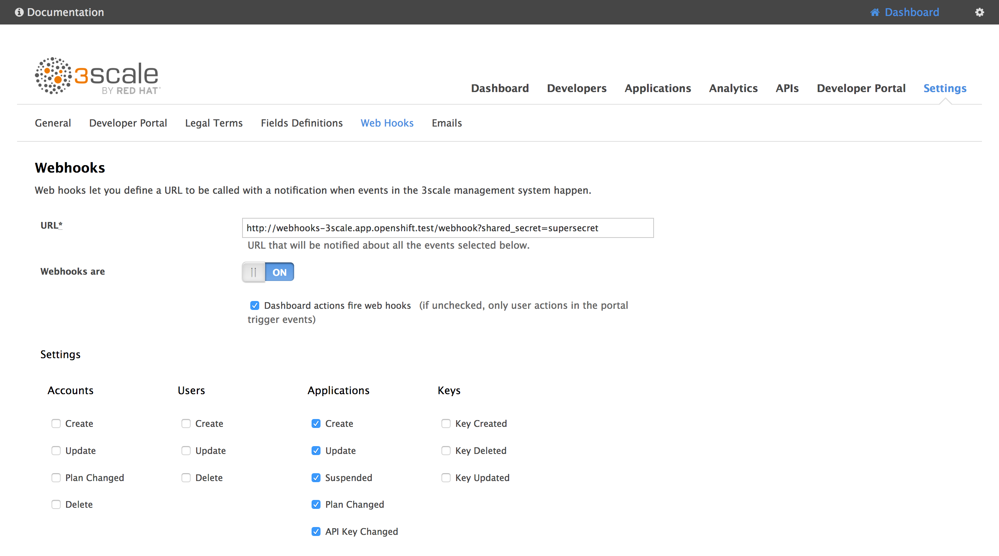

# A sample project to work on 3scale Web Hooks

## Introduction

This project is a framework to ease the use of WebHooks with 3scale.
It also provides out-of-the-box a sample implementation that synchronizes
3scale applications with Red Hat SSO clients (useful if you are implementing OAuth).

## Quick start

If you are interested only in the app/client synchronization between 3scale
and Red Hat SSO, follow the instructions below.

First of all, Red Hat SSO needs to be deployed with the `SSO_SERVICE_USERNAME`
and `SSO_SERVICE_PASSWORD` environment variables. If not already done, update
your DeploymentConfig:

```
oc set env dc/sso SSO_SERVICE_USERNAME=cli
oc set env dc/sso SSO_SERVICE_PASSWORD=secret
oc rollout latest sso
```

Then, you can instantiate this project:

```
oc new-app https://github.com/nmasse-itix/3scale-webhooks-sample.git --strategy=source --name=webhooks -e SSO_REALM=3scale -e SSO_HOSTNAME=your.sso.hostname -e SSO_SERVICE_USERNAME=cli -e SSO_SERVICE_PASSWORD=secret -e SSO_CLIENT_ID=admin-cli -e SHARED_SECRET=supersecret -e WEBHOOKS_MODULES=log,sso
oc expose service webhooks
```

The possible environment variables are explained below:

| Environment Variable | Description | Required ? |
| --- | --- | --- |
| SSO_REALM | The SSO Realm in which we need to sync the clients. If you followed my documentations so far, I use "3scale" as a convention. | Yes |
| SSO_HOSTNAME | The hostname of your SSO server or OpenShift route. (Just the hostname, without https:// or a path) | Yes |
| SSO_SERVICE_USERNAME | The username we need to use to connect to Red Hat SSO | Yes |
| SSO_SERVICE_PASSWORD | The password we need to use to connect to Red Hat SSO | Yes |
| SSO_AUTH_REALM | The realm used to authenticate the service user. Defaults to SSO_REALM if not provided. | No |
| SSO_CLIENT_ID | The client id we need to use to connect to Red Hat SSO. In every SSO installation, there is one named `admin-cli`. | Yes |
| SHARED_SECRET | A shared secret between 3scale and the webhooks server in order to prevent anyone from submitting webhooks. | No |
| WEBHOOKS_MODULES | A coma separated list of modules to load and use as handlers. Two modules are provided with this project: `sso` and `log` | Yes |

Then, in the 3scale admin console, go to `Settings` > `Web Hooks`.
In the URL field, type in the URL of the webhooks route you created before, followed by `/webhooks`.
If you defined a shared secret, append `?shared_secret=<your_shared_secret>`

For instance:
```
http://webhooks-3scale.app.openshift.test/webhook?shared_secret=supersecret
```

Do not forget to enable Webhooks and check `Dashboard actions fire webhooks` !



**Note about the admin/service user:**

To be able to create clients in Red Hat SSO, you need to provide a valid user with
administrative privileges.

One way to do so is by setting the `SSO_SERVICE_USERNAME` and `SSO_SERVICE_PASSWORD`
environment variables on the SSO DeploymentConfig as explained above. It will create
user for you with the correct rights.

If you want to use the built-in `admin` user, it is possible but you have to be aware
that the `admin` user lays in the `master` realm. So you will have to pass the
`SSO_AUTH_REALM` environment variable.

For instance, if you want to create clients in the `3scale` realm and you want to
use the default `admin` user to do this, you will have to use the following variables:

```
SSO_SERVICE_USERNAME=admin
SSO_SERVICE_PASSWORD=secret
SSO_AUTH_REALM=master
SSO_REALM=3scale
```

## Developing a module

If you plan to develop a module, you will have to export three methods from
your module :
- init
- register
- handle

The `init` method can be used to initialize your module, such as reading configuration,
initializing variables, etc.

The `register` method is used to choose the kind of webhooks you want to receive.
To do this, you have to filter the list of available webhooks that you receive as
a parameter and return the filtered list.

Currently, available types are :
- application
- account
- user

The `handle` method is called when a webhook is received.

See the [log.js](log.js) file that provides a minimal example of a working module.

Note that there might be multiple modules loaded to handle the same webhooks, so
you have to take care of calling the next module in the chain. This is easy, just
make sure in all cases (error or success), you call `next()`.

## Installing your module

If you developed a custom module, the easiest way is to fork this repository,
make your changes, commit your custom module and deploy it in OpenShift using
S2I (as explained above).

You just have to change the `WEBHOOKS_MODULES` environment variable to add
your module to the list (or replace it completely):

```
oc set env dc/webhooks WEBHOOKS_MODULES=your_custom_module
```

But, if you do not want to fork this repository, you can install your module
using ConfigMap.

Let's say you developed a module named `test` in a file `test.js`, you can deploy it like so:
```
oc create configmap custom-module --from-file=test.js
oc volume dc/webhooks --add -m /opt/app-root/src/custom -t configmap --configmap-name=custom-module --name custom-module
oc set env dc/webhooks WEBHOOKS_MODULES=custom/test
```

## Hacking

If you need to debug or have a non-trivial development to do, it is easier to
run NodeJS locally:

```
export SSO_REALM=3scale
export SSO_HOSTNAME=secure-sso-sso.app.openshift.test
export SSO_CLIENT_ID=admin-cli
export SSO_SERVICE_USERNAME=cli
export SSO_SERVICE_PASSWORD=secret
export SHARED_SECRET=supersecret
export WEBHOOKS_MODULES=log,sso
node server.js
```

## Debugging

You should get a fairly good amount of logs on the console output.
If you need to debug a module, you can issue a `GET` on `/` to get information:

```
$ curl http://webhooks-3scale.app.openshift.test/
{
  "name": "3scale Sample Webhook",
  "description": "A sample project that handles 3scale webhooks",
  "endpoints": [
    {
      "url": "/webhook",
      "verbs": [
        "GET",
        "POST"
      ]
    }
  ],
  "documentation": {
    "GitHub": "https://github.com/nmasse-itix/3scale-webhooks-sample"
  },
  "handlersByType": {
    "application": [
      "log",
      "sso"
    ]
  },
  "handlersState": {
    "log": {
      "loaded": true,
      "initialized": true,
      "registered": true
    },
    "custom/test": {
      "loaded": false,
      "error": "a is not defined"
    },
    "sso": {
      "loaded": true,
      "initialized": true,
      "registered": true
    }
  }
}
```

In this example, you can see that the module `custom/test` cannot be loaded
because of a parse error (`a is not defined`).
